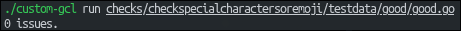
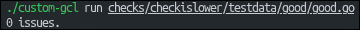
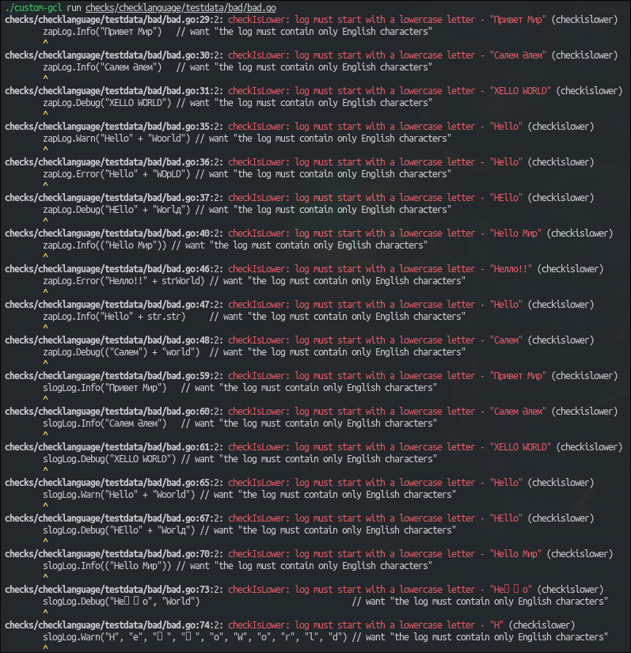
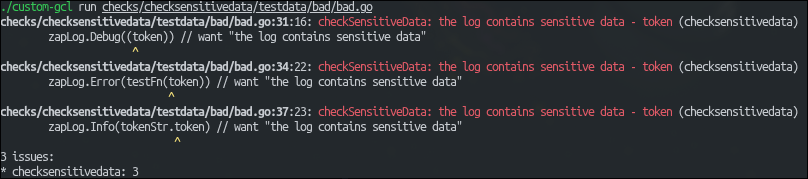
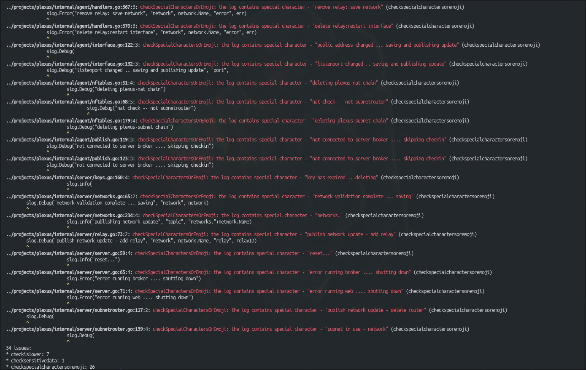
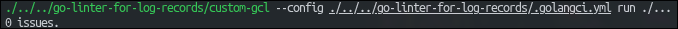
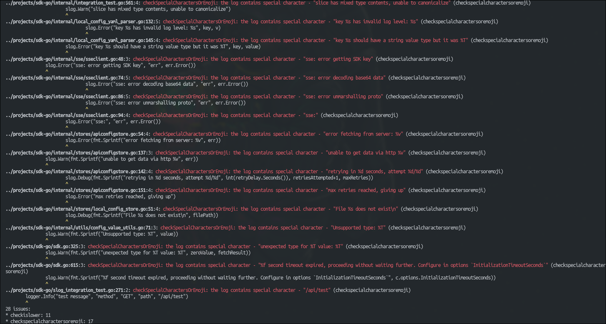

<h1 align="center">
  <a href="https://github.com/EXPECTEDD/go-linter-for-log-records" target="_blank">go-linter-for-log-records</a>
</h1>

<h3 align="center">Линтер для проверки логов</h3>

Данный проект создан в качестве тестового задания

## Реализованные линтеры

- checkislower - Для проверки на строчную букву в начале сообщения
- checklanguage - Для проверки на английский язык
- checksensitivedata - Для проверки чувствительных данных
- checkspecialcharactersoremoji - Для проверки на спецсимволы и эмодзи

## Структура проекта

```text
go-linter-for-log-records/
├─ checks/                                              # Общая папка с линтерами
│  ├─ checkislower/                                     # Линтер для проверки на строчную букву в начале сообщения
│  │  ├─ testdata/                                      # Тестовые данные
│  │  │  ├─ bad/
│  │  │  │  ├─ bad.go
│  │  │  │  ├─ go.mod
│  │  │  │  └─ go.sum
│  │  │  └─ good/
│  │  │     ├─ go.mod
│  │  │     ├─ go.sum
│  │  │     └─ good.go
│  │  ├─ check_is_lower_test.go                         # Тесты
│  │  └─ check_is_lower.go                              # Реализация линтера
│  ├─ checklanguage/                                    # Линтер для проверки на английский язык
│  │  ├─ testdata/                                      # Тестовые данные
│  │  │  ├─ bad/
│  │  │  │  ├─ bad.go
│  │  │  │  ├─ go.mod
│  │  │  │  └─ go.sum
│  │  │  └─ good/
│  │  │     ├─ go.mod
│  │  │     ├─ go.sum
│  │  │     └─ good.go
│  │  ├─ check_language_test.go                         # Тесты
│  │  └─ check_language.go                              # Реализация линтера
│  ├─ checksensitivedata/                               # Линтер для проверки чувствительных данных
│  │  ├─ testdata/                                      # Тестовые данные
│  │  │  ├─ bad/
│  │  │  │  ├─ bad.go
│  │  │  │  ├─ go.mod
│  │  │  │  └─ go.sum
│  │  │  └─ good/
│  │  │     ├─ go.mod
│  │  │     ├─ go.sum
│  │  │     └─ good.go
│  │  ├─ check_sensitive_data_test.go                   # Тесты
│  │  └─ check_sensitive_data.go                        # Реализация линтера
│  ├─ checkspecialcharactersoremoji/                    # Линтер для проверки на спецсимволы и эмодзи
│  │  ├─ testdata/                                      # Тестовые данные
│  │  │  ├─ bad/
│  │  │  │  ├─ bad.go
│  │  │  │  ├─ go.mod
│  │  │  │  └─ go.sum
│  │  │  └─ good/
│  │  │     ├─ go.mod
│  │  │     ├─ go.sum
│  │  │     └─ good.go
│  │  ├─ check_special_characters_or_emoji_test.go      # Тесты
│  │  └─ check_special_characters_or_emoji.go           # Реализация линтера
│  └─ checkData.go                                      # Вспомогательный пакет для линтеров с данными для проверки
├─ cmd/
│  └─ linter/
│     └─ main.go
├─ plugin/                                              # Плагин для golangci-lint
│  └─ plugin.go
├─ .custom-gcl.yml                                      # Конфиг для автоматической сборки golangci-lint с кастомным линтером
├─ .gitignore
├─ .golangci.yml                                        # Конфиг для кастомного golangci-lint
├─ go.mod
├─ go.sum
└─ README
```

## Поддерживаемые логгеры

- slog
- zap

## Инструкция по установке и использованию

1. Склонируйте проект на свой ПК

```bash
git clone https://github.com/EXPECTEDD/go-linter-for-log-records.git
```

2. Установите [golangci-lint](https://golangci-lint.run/docs/welcome/install/local/)

3. Соберите golangci-lint с реализованными линтерами

```bash
golangci-lint custom
```

4. Использование сгенерированного линтера на файлах проекта

```bash
./custom-gcl run path/to/code/code.go
```

5. Использование сгенерированного линтера на сторонних проектах

 - Перейти в нужный проект
```bash
  cd some/project
```

- Запустить линтер с относительным путем внутри проекта и указанием конфиг файла
```bash
  ./path/to/liner/custom-gcl --config ./path/to/config/.golangci.yml run ./...
```

## Запуск тестов
```bash
go test ./...
```

## Настройка конфига

1. Если нужно добавить/убрать какое либо правило для custom-gcl, внесите изменение в конфиг .golangci.yml

Пример:
```text
  ...
  enable:
    - checkislower
    - checklanguage
  ...
```
Теперь код будет проверятся только этими линтерами.

## Примеры использования

1. Тестовые данные









2. Сторонний проект
 - [plexus](https://github.com/devilcove/plexus)
 
 

 - [Kuper-Tech/work](https://github.com/Kuper-Tech/work)

 

 - [sdk-go](https://github.com/ReforgeHQ/sdk-go/tree/main)

 